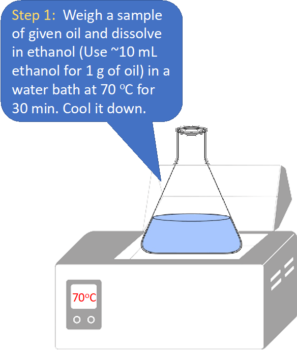
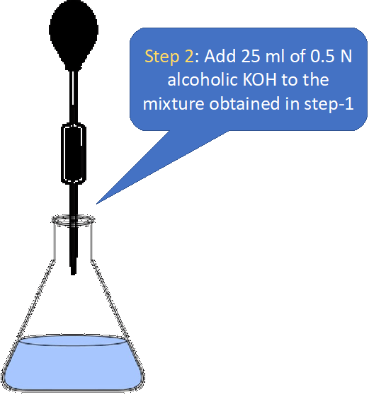
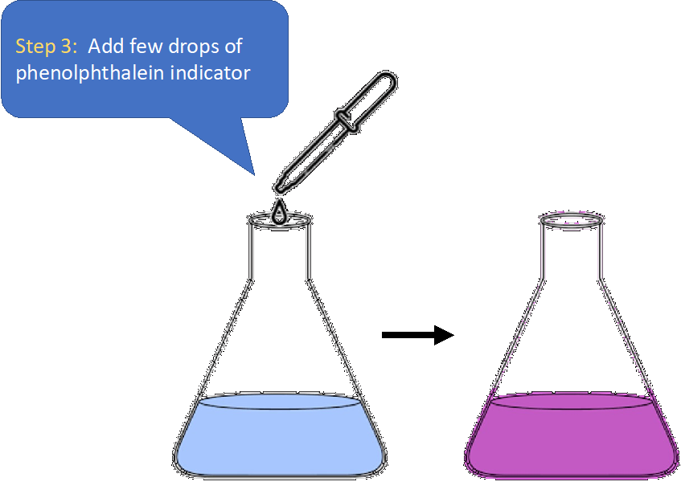
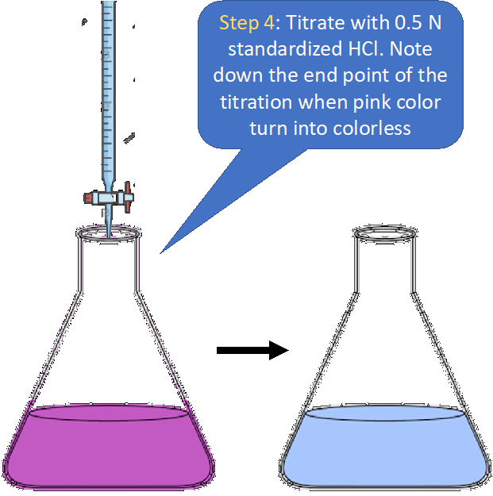
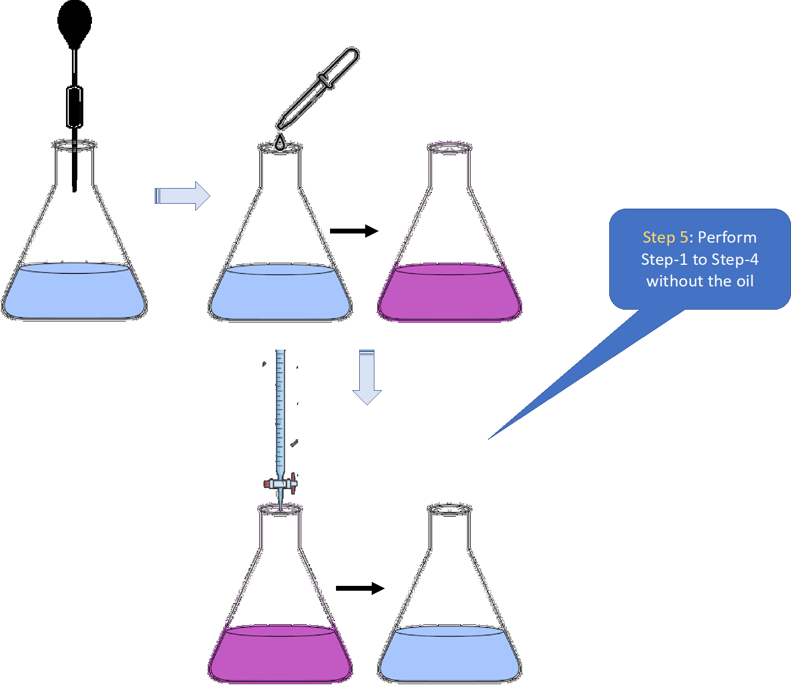
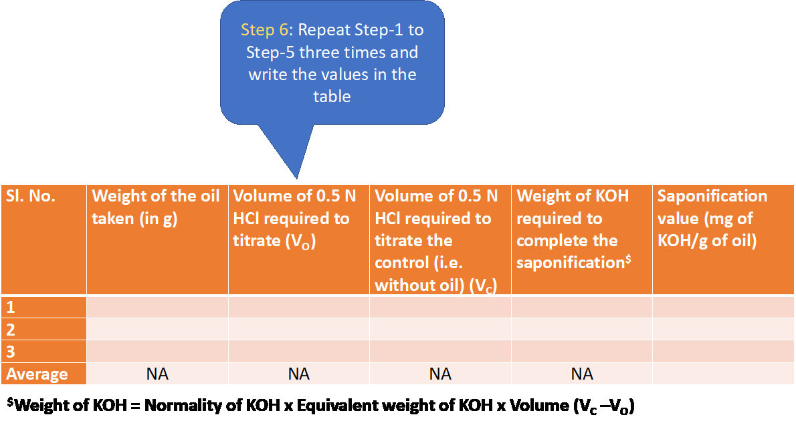
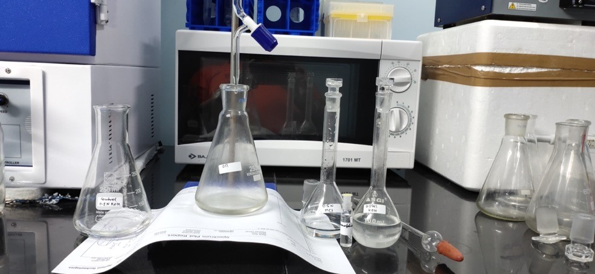
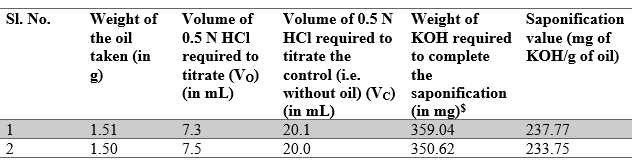

<b>Procedure</b>  
<b>5.1. Materials & Reagents Required:</b> 

1)	Fat/oil [e.g. coconut oil, sunflower oil]  
2)	Conical flask (100 mL)  
3)	Weighing balance  
4)	Dropper  
5)	Water bath  
6)	Glass pipette (25 mL)  
7)	Burette (50 mL) 
8)	Ethanol (95%)  
9)	Potassium hydroxide [~0.5 N] in ethanol 
10)	Hydrochloric acid (standardized and adjusted to 0.5 N) 
11)	Phenolphthalein indicator  
<b>5.2. Procedure in laboratory (diagram)</b>  
  
  
 
 
  
 
<b>5.3. Procedure in laboratory</b> 
 
<b>See video!</b>  
<b>5.4. Data and the analysis</b>  

<b>$Weight of KOH = Normality of KOH x Equivalent weight of KOH x Volume (VC –VO)</b>  

<b>5.5. Procedure in simulator of the experiment</b>  

To be added based on the simulation

<b>6. Simulator</b>  

To be created

<b>7. Analysis</b>  
A.	Note down the volume of standardized 0.5 N HCl required for the oil sample and control. 
B.	Calculate the weight of KOH required to saponify the taken oil. 
C.	Calculate the saponification value. 

<b>The saponification value of oil is 237.84</b>

