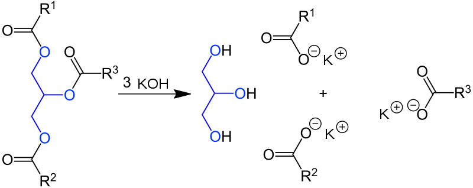
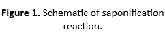

<b>Theory of the experiment:</b>
Saponification is a type of reaction in which ester molecules are broken to create carboxylic acid (-COOH) and alcohol (-OH), in presence of base (e.g. KOH, NaOH, etc.). Vegetable oils and animal fats are the triesters (also called triglycerides) as these have three ester groups derived from long chain fatty acids. These are the traditional materials for saponification and can be converted to soap in either a one- or a two-step process. In traditional one-step process, the triglyceride is treated with a strong base (e.g. KOH), which cleaves the ester bond; releasing fatty acid salts (soaps) and poly-alcohol (glycerol) (see Fig. 1.).  

Saponification value is determined as the number of milligrams of KOH required to completely saponify one gram of the oil or fat. In this experiment we will take a known amount of the oil or fat and treat it with excess of a standard KOH solution. Then we will measure the amount of unreacted KOH by titrating the solution with a standard acid. An identical blank experiment will be performed where there is no fat or oil.  
  
 

